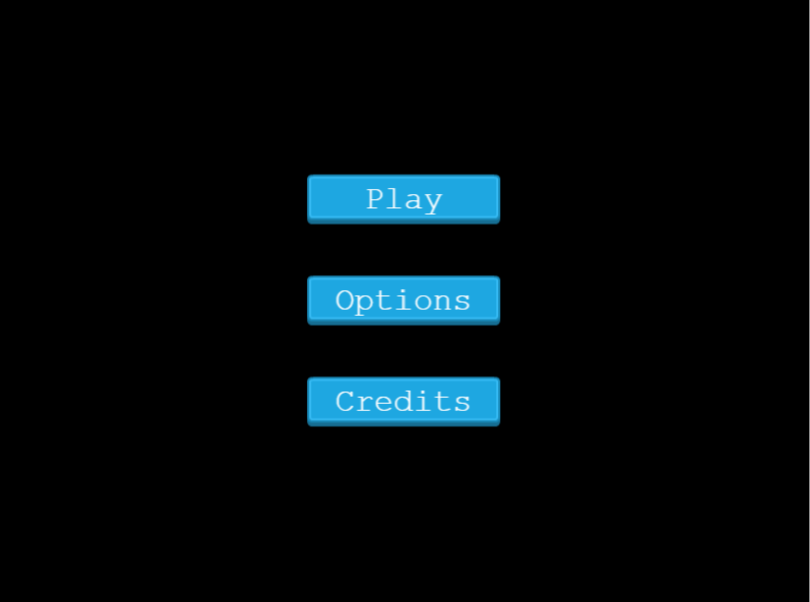
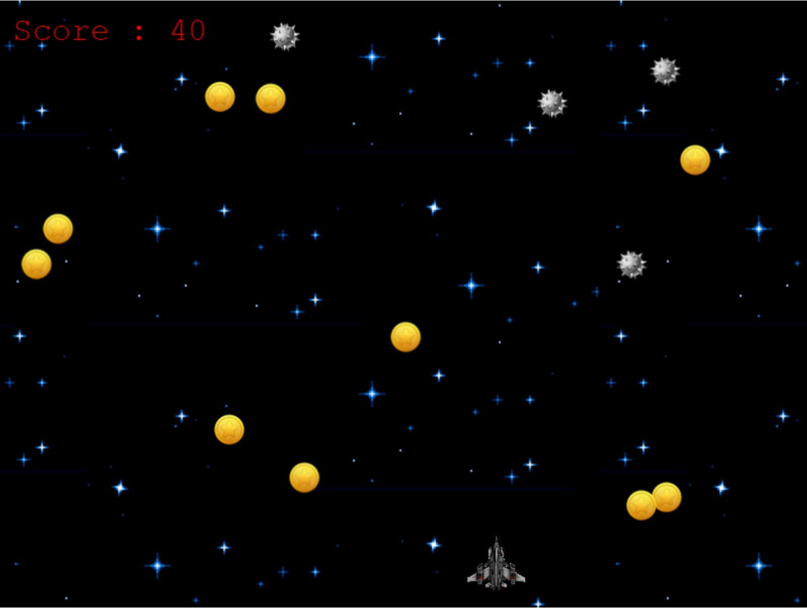
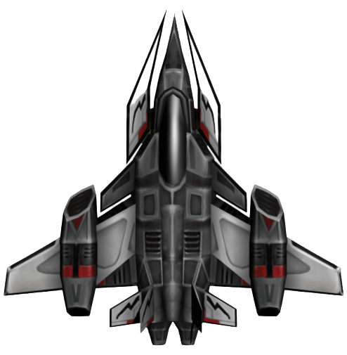

# Javascript-Capstone Project: Build a Shooter Game

<h1 align="center">
  JS Shooter Game
</h1>

> Final project in the Microverse JavaScript Curriculum

Implementation of a Space Shooter Game built with the [Phaser 3](https://phaser.io/phaser3) framework

## About The Project

The main objective of this project was to design and build a platform game. The basics of the game are used from the [Space Shooter Game](https://learn.yorkcs.com/category/tutorials/gamedev/phaser-3/build-a-space-shooter-with-phaser-3/) using Phaser and Javascript among other technologies.

### Scenes




Live version of the project: [Live version](https://nervous-mcnulty-6b379e.netlify.app/)

## The game

The concept of game design is simple, as shown on screens. A jet in space shoots the bombs and collects coins to get scores. If the Jet collides with a bomb, the game is over. All assets are provided by code4cause.

### Characters

* Player: <div ></div>
It can move at 4 directions, and use the right click on the mouse to shoot enemies.

* Enemy: <div ></div>
Bomb: It will appear randomly at random velocity. You receive +10 every time you make it explode.

* Collectible:  <div ></div>
Coin: It will appear at a random velocity. You will receive +5 points every time you collect one successfully

## Instructions to Play

- Enter your name.

- Press 'Play' to start playing.

- Press 'Options' to enable/disable sound features.

- Press 'Credits' to see who made it possible.

- To play you need the Keyboard and the Mouse.

- CONTROLS:

  - Press 'Up Arrow' to move Up.

  - Press 'Down Arrow' to move Down.

  - Press 'Left Arrow' to move Left.

  - Press 'Right Arrow' to move Right.

  - Press 'Right Click' to SHOOT.

- Use the mouse for the non-game and dialogues screens.

- Have Fun Playing!

#### Get a local copy

_npm required_ - [get npm](https://www.npmjs.com/get-npm)

### Installation

You can always use the [live version](https://nervous-mcnulty-6b379e.netlify.app/) to play right away or install it locally using these steps:

**Clone the repository by running this command in your terminal**

```
git clone https://github.com/Haywhizzz/JS-Phaser-ShooterGame
```

**Navigate into the newly created folder**

```
cd JS-Phaser-ShooterGame
```

#### Get the dependencies needed for the game

`$ npm install`

#### Start the server

`$ npm start`

**Visit this link to see the game in your browser**

```
http://localhost:8080/
```

**Run Jest tests**

```
npm run test
```
## Technologies used

- HTML5/CSS
- Phaser 3
- Webpack
- Javascript
- Eslint
- Babel
- Jest for testing
- [Netlify](https://www.netlify.com/) for deployment
- [Leaderboard API service](https://www.notion.so/Leaderboard-API-service-24c0c3c116974ac49488d4eb0267ade3) for high scores

## Author

👤 **Oyeleke Ayomide**

- Github: [@Haywhizzz](https://github.com/Haywhizzz)
- Twitter: [@Haywhizzz](https://twitter.com/Haywhizzz)
- Linkedin: [Haywhizzz](https://www.linkedin.com/in/oyelekeayomide)

## Contributing

Contributions, issues and feature requests are welcome!

Feel free to check the [issues page](https://github.com/Haywhizzz/JS-Phaser-ShooterGame/issues).

## Show your Support

Give a ⭐️ if you like this project!

## Acknowledgments

- [Microverse](https://www.microverse.org/)
- [Phaser](https://phaser.io/)
- [https://learn.yorkcs.com/](https://learn.yorkcs.com/)